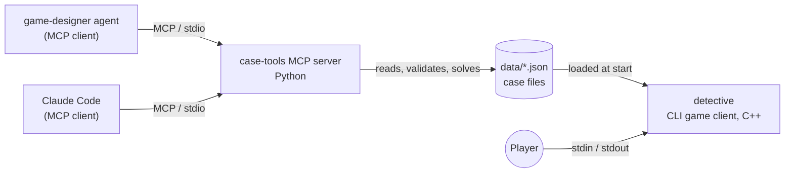

# Cold Trail

A CLI text detective game: investigate a crime scene, gather evidence, interview suspects, and accuse the killer. Choose wisely—you get one accusation.

## How to Play

Navigate locations, talk to suspects and learn their stories, examine evidence for clues. Piece together the facts to identify the culprit. Accusing the real killer before you have enough evidence is refused and the game goes on. Accusing anyone else ends the game: one wrong accusation means game over.

## Commands

| Command | Usage | Notes |
|---------|-------|-------|
| `look` | Show current location, exits, items, people | Default when you arrive |
| `go <place>` | Move to an adjacent location | Case-insensitive |
| `talk <person>` | Interview a suspect or witness | Full name required, e.g., `talk Mrs. Pell` |
| `examine <item>` | Inspect an item for clues | Case-insensitive |
| `clues` | List all clues found so far | Shows your evidence |
| `accuse <person>` | Accuse a suspect (one chance) | Full name required; must have required evidence |
| `help` | Show command reference | |
| `quit` | Exit the game | |

Names (places, people, items) are matched case-insensitively, but the full name is required.

## Build and Test

### Prerequisites

Use the CLion toolchain (Windows only):

```powershell
$b="C:\Program Files\JetBrains\CLion 2026.2.3.1\bin"
$env:PATH="$b\cmake\win\x64\bin;$b\ninja\win\x64;$b\mingw\bin;$env:PATH"
```

(This sets up CMake, Ninja, and MinGW; for CI/other platforms, these are pre-installed.)

### Build and Test

```powershell
cmake -S . -B build -G Ninja -DCMAKE_BUILD_TYPE=Debug
cmake --build build --parallel
ctest --test-dir build --output-on-failure
```

Expected: all tests pass.

## Run the Game

```bash
build/detective [case.json]
```

- Default case: `data/case01.json` (the absolute path of the data directory is baked in at build time; if you move the binary, pass the case path as `argv[1]`)
- Optional: specify a case file path to load a different case

Example:
```bash
build/detective data/case01.json
```

## CLion Setup

1. Open the repository folder in CLion
2. CMake configuration loads automatically
3. Create or select run configuration `detective`
4. Run via IDE or terminal

## Python tooling (case-tools MCP server)

`tools/case-tools/` is a Python MCP server (stdio) that checks case files while you write them. It does not depend on the C++ build.

```powershell
py -3.13 -m venv .venv
.venv\Scripts\python -m pip install -e "tools/case-tools[dev]"
.venv\Scripts\python -m pytest tools/case-tools
```

| MCP item | Name | What it does |
|----------|------|--------------|
| tool | `validate_case(path)` | Every format problem at once: wrong types, missing fields, dangling references, duplicate ids and names, non-snake_case ids |
| tool | `solve_case(path)` | Simulates a player: which clues are reachable, in what order (go / examine / talk steps), whether the required clues are |
| tool | `lint_case(path)` | Quality warnings: sizes, no red herring, unlock chain deeper than 3, unobtainable clue, one-way exit, silent suspect |
| resource | `case-format://spec` | `docs/case-format.md` |
| prompt | `design_case(theme)` | Template for designing a new case |

Paths must look like `data/<name>.json` (relative, no subdirectories). Rejected paths, missing files and invalid JSON come back as a result with an `error` field, never as a crash.

**Use it from Claude Code:** `.mcp.json` ships with the repo. Set the environment variable `CASE_TOOLS_PYTHON` to the venv interpreter (for example `.venv\Scripts\python.exe`), restart Claude Code, approve the project server and check `claude mcp list`. The `game-designer` agent is allowed to call the three tools.

## Case File Format

Detective cases are JSON files. See `docs/case-format.md` for the schema. A case defines locations, suspects, items, clues, and the solution (required evidence and killer).

## Architecture

Two independent programs share one contract: the case file format (`docs/case-format.md`).



- **Game client (`detective`, C++20):** loads a case through the validating loader, then runs the game loop: parser turns a line into a command, the engine (`Game`) updates state and returns text. The engine does no I/O, so it is unit-testable.
- **Case files (`data/*.json`):** the only data both sides understand. The format is documented in `docs/case-format.md`.
- **MCP server (`case-tools`, Python):** gives MCP clients tools to validate a case, solve it (which clues are reachable, in what order) and lint its quality, plus the format spec as a resource. It does not depend on the C++ build. Design: `docs/superpowers/specs/2026-10-04-case-tools-mcp-design.md`.
- **MCP clients:** Claude Code and the `game-designer` agent. They call the server's tools while writing cases; the player never talks to MCP.

## Project Layout

```
src/               Engine: case loader, command parser, game logic
tests/             GoogleTest suite
data/              Case files (JSON)
tools/case-tools/  MCP server in Python (validate, solve, lint cases)
.mcp.json          Registers the case-tools MCP server for Claude Code
docs/              Documentation
  case-format.md   Case JSON schema and design rules
  superpowers/     Specs and plans
CMakeLists.txt     Build configuration
```

## Team Roles

| Role | Owner | Scope |
|------|-------|-------|
| Lead | main session | Delegates tasks, reviews PRs first (as a PR comment) |
| Programmer | `programmer` agent | `src/`, CMakeLists.txt |
| Game Designer | `game-designer` agent | `data/`, case-format.md |
| QA | `qa` agent | `tests/`, writes tests first |
| User | (you) | Reviews and merges PRs |

## PR Workflow

1. Lead reviews the PR first and posts findings as a PR comment (never approves, merges or closes)
2. User reviews, then merges or closes
3. Remarks are fixed by the programmer, who pushes to the PR branch (test or data remarks go to qa / game-designer)
